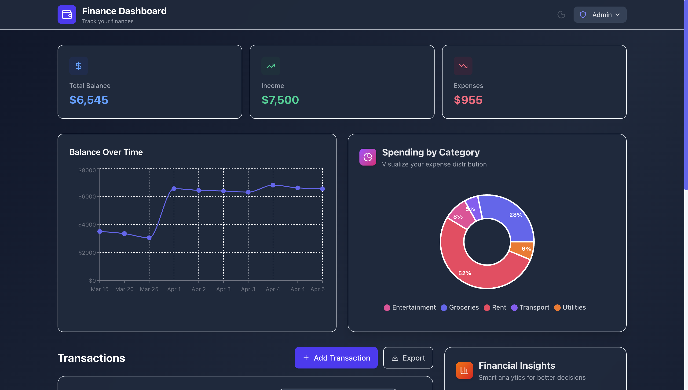
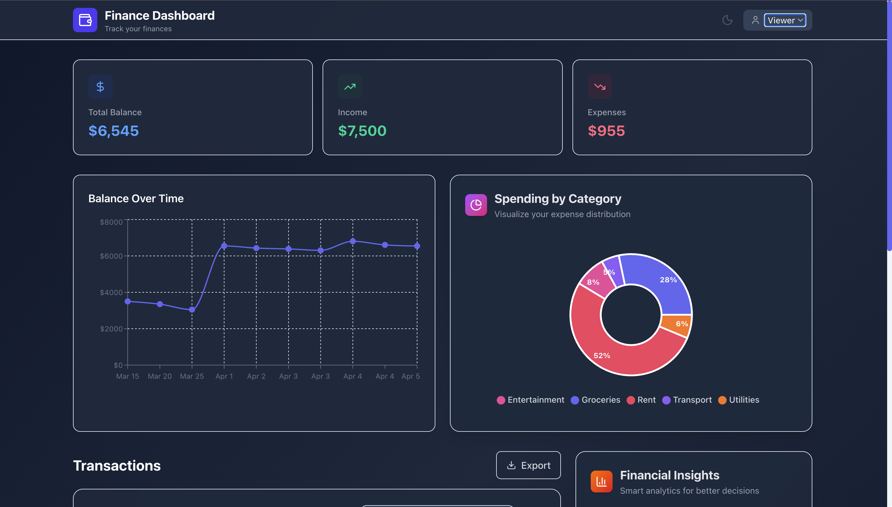
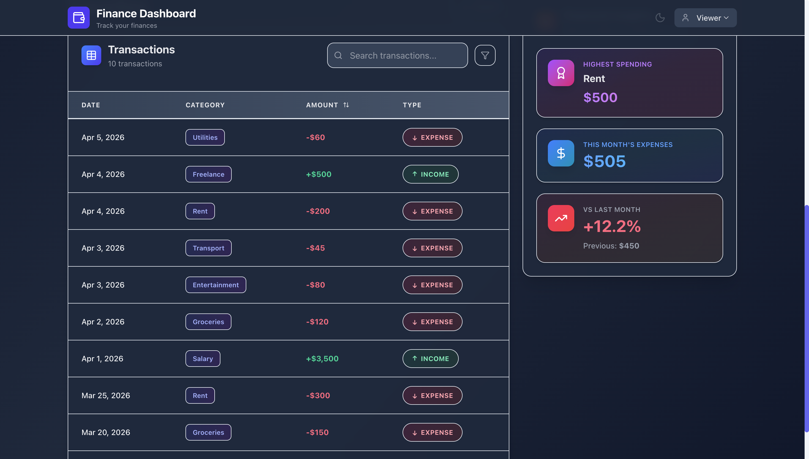

# Finance Dashboard

A clean, modern financial dashboard built with React that helps users track income, expenses, and understand spending patterns through intuitive visualizations.


---

## 📸 Preview



---

## ✨ Features

### 📊 Financial Overview

- **Summary Cards**: Real-time display of Total Balance, Income, and Expenses  
- **Balance Trend Chart**: Interactive line chart showing balance changes over time  
- **Spending Breakdown**: Pie chart visualization of expenses by category  

### 💰 Transaction Management

- View all transactions with date, amount, category, and type  
- Search transactions by category or type  
- Filter by specific categories  
- Sort by date or amount (ascending/descending)  
- Add new transactions (Admin only)  
- Edit existing transactions (Admin only)  
- Delete transactions with confirmation (Admin only)  
- Export transactions to CSV  

### 👥 Role-Based Access

- **Admin Role**: Full CRUD operations  
- **Viewer Role**: Read-only access  
- Easy role switching  

### 📈 Smart Insights

- Highest spending category  
- Monthly expenses  
- Month-over-month comparison  
- Trend indicators  

### 🎨 User Experience

- Dark Mode  
- Responsive design  
- Smooth animations  
- Empty states  
- localStorage persistence  

---

## 📸 Screenshots

### 🖥️ Dashboard


### 👨‍💼 Admin View


### 👀 Viewer Mode


---

## 🚀 Tech Stack

- React 18  
- Vite  
- Tailwind CSS  
- Zustand  
- Recharts  
- Framer Motion  
- Lucide React  

---

## 📦 Installation

```bash
git clone https://github.com/omsoni21/zorvyn.git finance-dashboard
cd finance-dashboard
npm install
npm run dev
